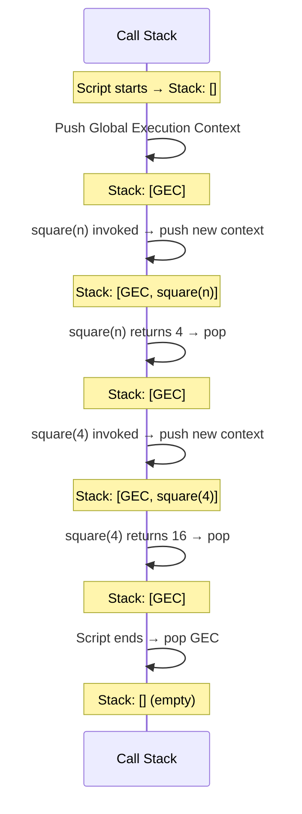

# How JavaScript Works — Execution Context & Call Stack

> 🧠 **Quick Recall (30-sec refresher)**
> - Everything in JS runs inside an **Execution Context** — one Global Context is created first, and a new one is created on every function call.
> - Each context builds in **two phases**: Memory Creation (variables → `undefined`, functions → stored whole) then Code Execution (line by line, real values assigned).
> - The **Call Stack** tracks which context is currently running, LIFO — last pushed, first popped. A function returning destroys its context and pops it off.

**Tags:** #fundamentals #execution-context #call-stack · **Interview Frequency:** 🔴 High · **Last Reviewed:** 2026-07-31

---

## Why This Matters
Hoisting, scope, closures, `this`, and the event loop all make sense — or don't — depending on whether this is solid first. Skip it and every later topic feels like a separate rule to memorize instead of one consistent system.

## The Concept

**Core rule:** everything in JavaScript happens inside an **Execution Context** — a sealed "box" where code is evaluated and run. The moment a script starts, a **Global Execution Context (GEC)** is created automatically, and every context — global or otherwise — is built in two distinct phases:

1. **Memory Creation Phase** — JS scans the code *before* running any of it and reserves memory:
   - Variables (`var`) → the placeholder `undefined`
   - Function declarations → stored **in their entirety** — the whole function body, ready to run
2. **Code Execution Phase** — JS goes line by line, assigns real values, and runs the logic.

This two-pass system is *why* hoisting exists: by the time execution actually starts, memory for every variable and function already exists somewhere.

## Example Walkthrough

```js
var n = 2;
function square(num) {
    var ans = num * num;
    return ans;
}
var square2 = square(n);
var square4 = square(4);
```

**Step 1 — Global Memory Creation.** JS pre-scans and reserves memory:
- `n` → `undefined`
- `square` → the entire function body
- `square2` → `undefined`
- `square4` → `undefined`

**Step 2 — Global Code Execution.**
- `n = 2` → `n` updates from `undefined` to `2`.
- The `square` definition is skipped — it's just a definition, nothing to run yet.
- `square(n)` is invoked → a **brand-new Execution Context is created inside the GEC**, and it runs through the same two phases on its own local scale:
  - *Memory:* `num` → `undefined`, `ans` → `undefined`
  - *Execution:* `num` → `2` (the argument passed in), `ans` → `2 * 2` = `4`, `return ans` sends `4` back — and the moment it returns, **this entire function context is destroyed**.
  - Back in the GEC: `square2` → `4`.
- `square(4)` repeats the exact same cycle in a fresh context: `num` → `4`, `ans` → `16`, context destroyed, `square4` → `16`.

**Final state:** `square2 = 4`, `square4 = 16`.

## Diagram

The Call Stack is what manages all of this — it tracks execution order using **LIFO** (Last In, First Out):



## Common Interview Questions

**Q: What are the two phases of an Execution Context?**
A: Memory Creation Phase (variables → `undefined`, functions → stored whole) and Code Execution Phase (line by line, real values assigned).

**Q: During memory creation, what's the difference in how variables and functions are stored?**
A: Variables get the placeholder `undefined`. Function *declarations* get their entire body stored immediately — callable even before their line in the file runs.

**Q: Why does every function call get its own Execution Context, even for two calls to the same function?**
A: Each call needs isolated memory for its own parameters and local variables. It's also exactly why recursion works — every call gets its own independent frame on the stack.

**Q: What is the Call Stack, and what happens if it overflows?**
A: The structure tracking which Execution Context is currently running, LIFO — push on invocation, pop on return. If contexts keep getting pushed without popping (recursion with no base case, for example), you get "Maximum Call Stack Size Exceeded" — a stack overflow.

## Gotchas / Common Misconceptions

- **"Only the function's name gets stored during memory creation."** Not for a function *declaration* — the whole body is stored, which is why you can call it before its line in the file executes. A function *expression* (`var square = function(num) {...}`) is different: only `square → undefined` is stored until the assignment line actually runs.
- **"JS reads the file once, top to bottom."** Not quite. Each Execution Context runs in *two* passes — memory, then execution. It's scanned once, then executed once, not read-and-run in a single pass.
- **"The Call Stack and the stack/heap memory split are the same thing."** Related, not identical. The Call Stack tracks execution contexts and function calls. The stack/heap distinction is about *where values themselves live* — primitives in stack memory, objects in the heap. Worth keeping separate in your head.

## Keywords
`execution context`, `call stack`, `memory creation phase`, `code execution phase`, `global execution context`, `GEC`, `function execution context`, `LIFO`, `stack overflow`, `JS engine internals`

## Related Notes
- [02 — Variables & Hoisting](./02-variables-and-hoisting.md) *(hoisting is a direct consequence of the memory creation phase above)*
- [05 — Async JavaScript](./05-async-javascript.md) *(the event loop works alongside the call stack — this file makes that one click faster)*

## Revision Log
- 2026-07-31: First written.
