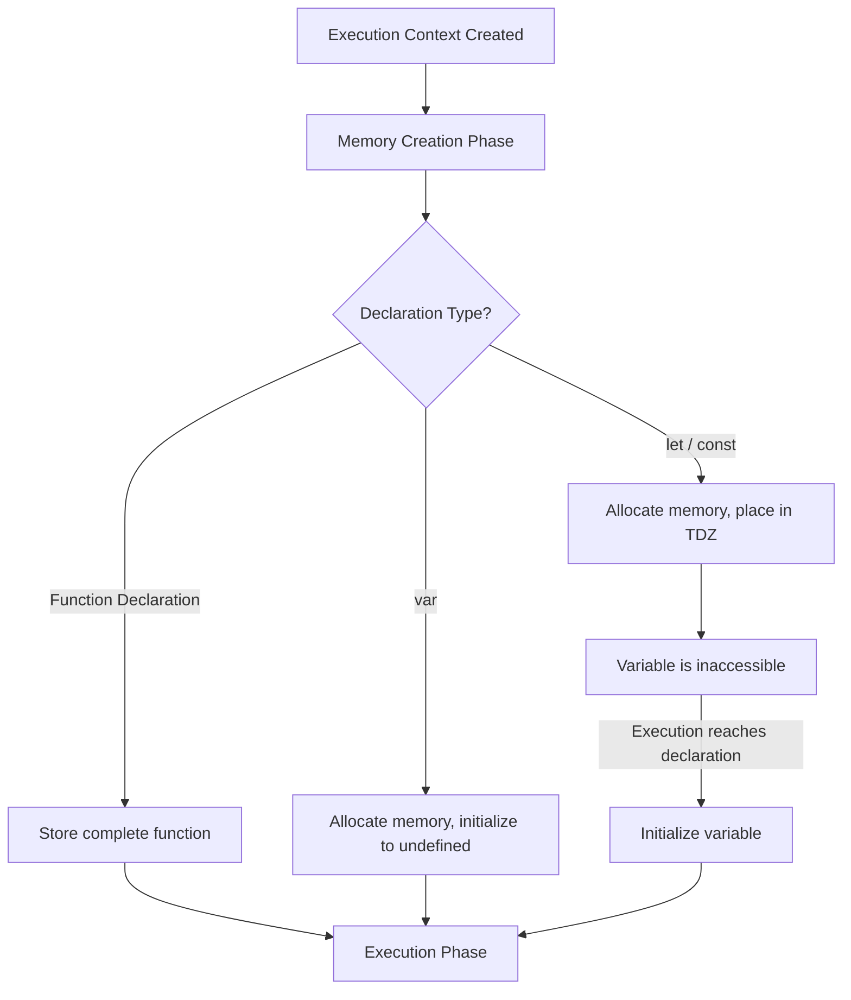

cat > /mnt/user-data/outputs/02-variables-and-hoisting.md << 'EOF'
# Variables, Hoisting, and the Temporal Dead Zone

> 🧠 **Quick Recall (30-sec refresher)**
> - Hoisting allocates memory for declarations before execution runs — nothing physically moves in the file.
> - `var` → allocated **and** initialized to `undefined`. `let`/`const` → allocated but **not** initialized (the TDZ) — even if an outer variable with the same name already exists, the local one shadows and blocks it from the top of its scope.
> - Function **declarations** are hoisted whole (callable early). Function **expressions** — `var x = function(){}`, `const x = () => {}`, any arrow function — follow their variable keyword's rules instead.

**Tags:** #fundamentals #hoisting #tdz #var #let #const #scope-shadowing · **Interview Frequency:** 🔴 High · **Last Reviewed:** 2026-07-31

---

## Why This Matters
Without this, you'll hit baffling `ReferenceError`s and silent `undefined` bugs the moment you start structuring larger files, working with closures in React, or pulling helper functions out of your UI components.

## The Concept

This is the same two-phase model from [01](./01-how-js-works.md) — Memory Creation, then Code Execution — applied specifically to what happens to each kind of declaration during that first phase:

1. **Function Declarations** — the engine stores the entire function in memory.
2. **`var` Declarations** — the engine allocates memory and immediately initializes it to the placeholder `undefined`.
3. **`let` & `const` Declarations** — the engine allocates memory but refuses to initialize it. From the top of the scope until the exact line the variable is declared, it sits in the **Temporal Dead Zone (TDZ)** — touching it throws.

## Example Walkthrough

```js
// 1. The classic var vs let
console.log(developer); // Output: undefined
var developer = "Bhiman";

// 2. The TDZ in action
console.log(framework); // Uncaught ReferenceError!
let framework = "Next.js";

// 3. Tricky: Scope Shadowing & TDZ
let colleague = "Harish";
function printColleague() {
    console.log(colleague);
    let colleague = "Unknown";
}
printColleague(); // Uncaught ReferenceError!

// 4. Function Declarations vs Expressions
console.log(greet()); // Output: "Hello!"
function greet() {
    return "Hello!";
}

console.log(sayHi()); // Uncaught TypeError: sayHi is not a function!
var sayHi = () => {
    return "Hi!";
}
```

### Step-by-Step Trace

#### Lines 1–3 (`var` Hoisting)
During Memory Creation, the engine finds `var developer` and immediately allocates + initializes it: `developer → undefined`. So `console.log(developer)` prints `undefined` — no error, because the variable already exists in memory. When execution reaches `developer = "Bhiman"`, the value updates from `undefined` to `"Bhiman"`.

#### Lines 5–7 (`let` and the TDZ)
The engine allocates memory for `framework` but does **not** initialize it — it's placed in the TDZ. `console.log(framework)` finds the variable, sees it's still uninitialized, and throws `ReferenceError: Cannot access 'framework' before initialization` instead of returning anything. Only once execution reaches `let framework = "Next.js"` does the TDZ end.

#### Lines 9–15 (Shadowing + TDZ — classic interview trap)
Many people expect `console.log(colleague)` to print `"Harish"`, since a global `colleague` already exists. It doesn't. Calling `printColleague()` creates a new execution context with its own Memory Creation Phase, which discovers `let colleague` inside the function and creates a **new local binding** — shadowing the global one immediately, from the top of the function, even though its declaration line hasn't run yet. Lookup for `colleague` finds this local (TDZ'd) variable first and stops there — it does not fall back to search the outer scope — so it throws `ReferenceError`, and the global `"Harish"` is never reached.

#### Lines 17–21 (Function Declaration Hoisting)
`function greet() {...}` is a declaration, so the engine stores the **entire function** during Memory Creation: `greet → function(){...}`. Calling `greet()` before its line in the file executes works fine — the whole function was already there.

#### Lines 23–26 (Function Expression Hoisting)
`sayHi` is declared with `var` and assigned an arrow function. Memory Creation only hoists the variable: `sayHi → undefined` — the function body is **not** hoisted, because it's an expression, not a declaration. So `sayHi()` at that point is really `undefined()`, which throws `TypeError: sayHi is not a function` — notably **not** a `ReferenceError`, since the variable does exist; it just doesn't hold a function yet.

## Diagram



## Common Interview Questions

**Q: Are `let` and `const` hoisted?**
A: Yes — both are fully hoisted in the Memory Creation Phase, so the engine knows they exist before execution starts. Unlike `var`, they aren't initialized to `undefined`; they sit in the TDZ until execution reaches their declaration line.

**Q: Why did ES6 introduce the Temporal Dead Zone?**
A: To turn a silent bug into a loud one. `var` accessed too early just returns `undefined`, quietly hiding the mistake. The TDZ throws a `ReferenceError` instead, forcing it to surface immediately.

**Q: In the shadowing example, why does `console.log(colleague)` throw instead of printing the outer `"Harish"`?**
A: The function has its own local `let colleague`, hoisted (in TDZ) for the whole function scope from the top. JS finds that local binding first and stops looking — it never falls through to the outer scope, TDZ or not.

**Q: Why does calling an arrow function before its `var` assignment throw `TypeError` instead of `ReferenceError`?**
A: An arrow function assigned to a `var` is a function *expression*, not a declaration — only the name is hoisted (as `undefined`), not the function body. Calling `undefined()` is what actually throws, and that's a `TypeError`.

**Q: What happens if you assign to a variable you never declared (e.g. `score = 100`)?**
A: In non-strict mode, JS creates an implicit global property on the global object — legal, but bad practice. In strict mode, it throws `ReferenceError: score is not defined`. Either way, it was never hoisted, because hoisting only applies to actual declarations.

## Gotchas / Common Misconceptions

- **"Hoisting physically moves code to the top of the file."** Nothing moves. Hoisting is just the engine allocating memory for declarations before execution begins — the source stays exactly where you wrote it.
- **"Arrow functions are hoisted just like function declarations."** Arrow functions are function *expressions* — their hoisting behavior depends entirely on the keyword storing them. `var greet = () => {}` hoists `greet` as `undefined` (→ `TypeError` if called early); `const greet = () => {}` puts `greet` in the TDZ (→ `ReferenceError` if called early).

## Keywords
`hoisting`, `temporal dead zone`, `TDZ`, `execution context`, `memory creation phase`, `var`, `let`, `const`, `function declaration`, `function expression`, `scope shadowing`, `ReferenceError`, `TypeError`, `implicit global`, `strict mode`

## Related Notes
- [01 — How JS Works](./01-how-js-works.md) *(this file's TDZ trace is Phase 1 vs. Phase 2 from there, applied to `let`/`const`)*
- [03 — Values vs. References](./03-values-vs-references.md) *(next up — once a variable is initialized, what does it actually hold?)*
- [04 — Functions & Scope](./04-functions-and-scope.md) *(to be written — the shadowing example above is really a scope-chain lookup, covered in full there)*

## Revision Log
- 2026-07-31: First written, including the scope-shadowing and function-declaration-vs-expression traces.
EOF
echo "Done"
