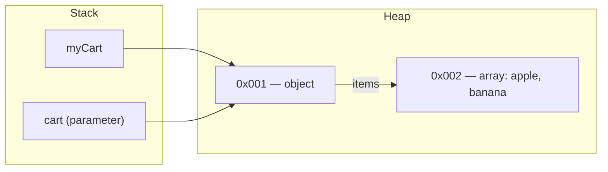

# Values vs. References — Primitives, Objects & the Stack/Heap Model

> 🧠 **Quick Recall (30-sec refresher)**
> - Primitives (`number`, `string`, `boolean`, etc.) are stored directly in a variable's own slot — commonly described as "on the stack." Copying one copies the actual value.
> - Objects, arrays, and functions live on the heap. A variable holding one only stores a reference (an address) — not the object itself.
> - Copying a reference (`const b = a`, or passing an object into a function) copies the *address*, not the object. Both names end up pointing at the same thing.
> - To get an actual independent copy, you need an explicit copy — e.g. `{...obj}` — and even that's only one level deep (a shallow copy).

**Tags:** #fundamentals #memory-model #reference-types #mutation · **Interview Frequency:** 🔴 High · **Last Reviewed:** 2026-08-01

---

## Why This Matters
This explains why mutating an object inside a function can silently affect code outside it, why `const` doesn't stop an object from changing, and why two variable names can "both break" when only one was supposedly touched. It's also the reason closures capture variables by reference rather than by snapshot — worth having solid before [closures](./05-closures.md).

## The Concept

Every value in JS is either a **primitive** or a **reference type**, and they're stored differently:

- **Primitives** (`number`, `string`, `boolean`, `null`, `undefined`, `symbol`, `bigint`) are stored directly in the variable's own memory slot. Assign one to another variable, and you get a real, independent copy of the value.
- **Reference types** (objects, arrays, functions) live on the **heap**. The variable itself — sitting on the stack — doesn't hold the object; it holds a **reference** (a memory address) pointing to where the object actually lives.

So when you assign a reference-type variable to another variable, or pass it as a function argument, you're copying the *address*, not the object. Both names now point at the exact same thing in memory — mutate it through either name, and both "see" the change.

**The nuance interviewers actually probe:** JavaScript is technically always *pass by value* — but for objects, the value being passed is the reference itself. That's why:
- **Mutating** the object a reference points to (`cart.items.push(...)`) is visible everywhere, because everyone's reference points to the same object.
- **Reassigning** a variable or parameter to a brand-new object (`cart = {...}`) only changes *that name's* reference — it doesn't reach back and change what any other variable points to.

```js
function replaceCart(cart) {
  cart = { items: ["totally new"] }; // reassigns the LOCAL reference only
}
replaceCart(myCart);
console.log(myCart.items); // unchanged — reassignment doesn't escape the function
```

## Example Walkthrough

**Case 1 — mutation through a function:**

```js
function addItem(cart, item) {
  cart.items.push(item);
}

const myCart = { items: ["apple"] };
addItem(myCart, "banana");
console.log(myCart.items); // ["apple", "banana"]
```

*After `myCart` is created* — the variable holds a reference (call it `0x001`) to an object on the heap, which itself holds a reference (`0x002`) to the array:
```
Stack:                Heap:
myCart → 0x001        0x001: { items: 0x002 }
                       0x002: ["apple"]
```

*`addItem(myCart, "banana")` is called* — a new execution context is created, and the parameter `cart` receives a **copy of the reference** — the same address, `0x001`:
```
Stack:                Heap:
myCart → 0x001        0x001: { items: 0x002 }
cart   → 0x001         0x002: ["apple"]
item   = "banana"
```

*`cart.items.push(item)` runs* — JS follows `0x001` → finds `items` points to `0x002` → pushes `"banana"` in directly:
```
Stack:                Heap:
myCart → 0x001        0x001: { items: 0x002 }
cart   → 0x001         0x002: ["apple", "banana"]  ← mutated
item   = "banana"
```

*Function returns, its context is destroyed* — `cart` is gone, but the heap object it pointed to was mutated in place, and `myCart` still points to it:
```
Stack:                Heap:
myCart → 0x001        0x001: { items: 0x002 }
                       0x002: ["apple", "banana"]
```

`cart` and `myCart` were always two names for the same object — the function never had to *return* anything for the caller to see the change.

**Case 2 — the "config" trap:**

```js
const config = {
  timeout: 3000,
  retries: 5,
  endpoint: "https://api.example.com"
};

const requestConfig = config;   // NOT a copy — same object
requestConfig.timeout = 10000;

console.log(config.timeout);    // 10000 — the "original" changed too
```

`requestConfig = config` copies the reference, not the object — there was only ever one object, with two names pointing at it. The fix is an explicit copy:

```js
const requestConfig = { ...config };  // a genuinely new object, different address
requestConfig.timeout = 10000;
console.log(config.timeout); // 3000 — untouched
```

`{...config}` (the spread operator) is one common way to get a real copy — full treatment of it is coming later, but for now: it's what actually creates new memory, where plain `=` does not.

## Diagram



## Common Interview Questions

**Q: What's the difference between how primitives and reference types are stored?**
A: Primitives live directly in the variable's own memory slot. Reference types live on the heap; the variable just holds an address pointing there.

**Q: If a function mutates an object passed into it, does the caller see the change?**
A: Yes — the parameter received a copy of the reference, not a copy of the object, so both point to the same heap location.

**Q: Does `const requestConfig = config` create a new object?**
A: No. `const` only stops `requestConfig` from being reassigned to something else later — it doesn't copy what it points to. Both names reference the identical object.

**Q: Is JavaScript "pass by value" or "pass by reference"?**
A: Technically always pass by value — but for objects, the value being passed is the reference itself. Mutating through it affects the original; reassigning the parameter to a new object does not.

**Q: How do you make an actual independent copy of an object?**
A: An explicit copy, e.g. `{...obj}` or `Object.assign({}, obj)` — and note it's shallow: nested objects/arrays inside are still shared references.

## Gotchas / Common Misconceptions

- **"`const` prevents mutation."** No — `const` only blocks *reassigning the variable itself*. `const arr = [1]; arr.push(2);` is completely legal.
- **"Spreading an object gives a fully independent copy."** Only one level deep. `{...obj}` copies top-level properties; a nested object inside is still the same shared reference as the original.
- **"This is 'pass by reference' the same way C++ or Python-by-alias works."** Close, but the precise term matters in interviews: JS passes the *reference by value* — reassigning a parameter never reaches back to the caller's variable, only mutation does.

## Keywords
`primitive types`, `reference types`, `stack`, `heap`, `pass by value`, `pass by reference`, `shallow copy`, `deep copy`, `mutation`, `object reference`, `spread operator`

## Related Notes
- [02 — Variables & Hoisting](./02-variables-and-hoisting.md) *(what a variable is; this file covers what it actually holds)*
- [04 — Functions & Scope](./04-functions-and-scope.md) *(function parameters receiving copies of references is exactly this behavior, applied to arguments)*
- [05 — Closures](./05-closures.md) *(closures capture the reference, not a snapshot — this is why)*

## Revision Log
- 2026-08-01: First written, from exercises on function mutation and shared object references.
