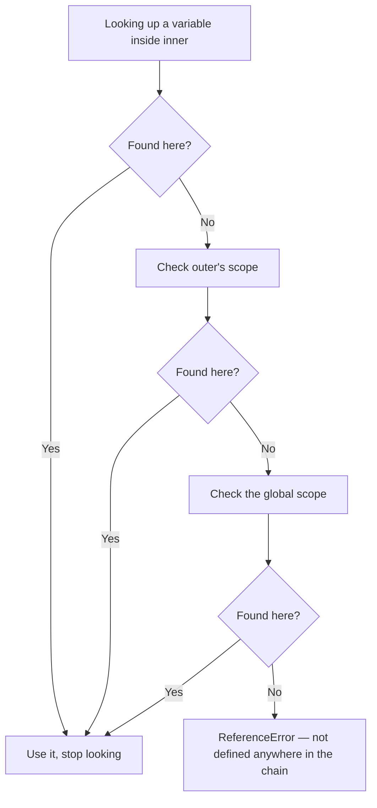

# Functions & Scope — Lexical Scope and Arrow Functions

> 🧠 **Quick Recall (30-sec refresher)**
> - Scope in JS is **lexical** — fixed by where a function is physically written, not by where or how it's later called. Looking up a variable walks the **scope chain**: current scope → its outer scope → ... → global, stopping at the first match.
> - `var` is **function-scoped** (ignores `{}` block boundaries); `let`/`const` are **block-scoped** (respect every `{}`).
> - Arrow functions don't have their own `this` (or `arguments`) — they inherit both lexically from the scope they were *defined* in, permanently. A regular function's `this` is decided fresh at *call* time instead.

**Tags:** #fundamentals #scope #lexical-scope #arrow-functions #this-keyword · **Interview Frequency:** 🔴 High · **Last Reviewed:** 2026-08-01

---

## Why This Matters
Lexical scope is the rule your entire mental model of "what can this line of code see" runs on — get it wrong and debugging turns into guesswork. The `this`-binding gap between arrow and regular functions is one of the most common real bugs (and interview questions) in JS, especially once callbacks, event handlers, or class methods show up.

## The Concept

**Lexical scope** means a function's access to variables is fixed by *where it's written* in the source — its physical nesting — not by where or how it's later called. Looking up a variable walks the **scope chain**: check the current (innermost) scope first, then the scope it's nested in, then that one's outer scope, and so on out to global — stopping at the very first match. That's exactly what made the shadowing trap in [02](./02-variables-and-hoisting.md) throw instead of quietly falling back to the outer variable.

Two more scope rules matter day to day:
- **Function scope vs. block scope** — `var` only respects function boundaries; a block (`if {}`, `for {}`, a bare `{}`) does nothing to contain it. `let`/`const` respect every block.
- **Arrow functions don't get their own scope for `this` or `arguments`** — they lexically inherit both from whatever scope they were *defined* in, permanently. A regular function's `this` is decided fresh every time it's *called*, based on how it's invoked.

## Example Walkthrough

### Part 1 — Lexical Scope & the Scope Chain

```js
const globalVar = "global";

function outer() {
  const outerVar = "outer";

  function inner() {
    const innerVar = "inner";
    console.log(innerVar, outerVar, globalVar);
  }

  inner();
}

outer();
// "inner" "outer" "global"
```

`inner` can see `outerVar` and `globalVar` because it's physically nested inside `outer`, which is nested inside the global scope — the scope chain at the point `inner` was *written* is `inner → outer → global`.

**The proof that it's write-time, not call-time:**

```js
const x = "global x";

function printX() {
  console.log(x);
}

function wrapper() {
  const x = "wrapper x";
  printX(); // what does this print?
}

wrapper();
// "global x" — NOT "wrapper x"
```

`printX` was defined in the global scope, so its scope chain is `printX → global`, full stop — it never sees `wrapper`'s `x`, even though it's *called* from inside `wrapper`. If JS used dynamic scope instead (some other languages do), this would print `"wrapper x"`. It doesn't, because JS scope is locked in at write-time.

### Part 2 — Function Scope vs. Block Scope

```js
function testScope() {
  if (true) {
    var functionScoped = "I leak out of the block";
    let blockScoped = "I stay inside the block";
  }
  console.log(functionScoped); // "I leak out of the block"
  console.log(blockScoped);    // ReferenceError: blockScoped is not defined
}

testScope();
```

The `if {}` block does nothing to contain `var` — it's visible anywhere in `testScope`. `let` is trapped inside the block it was declared in and doesn't exist outside it at all.

### Part 3 — Arrow Functions & Lexical `this`

Assuming strict mode — the default in ES modules, classes, and virtually all modern code, including everything in a Next.js project:

```js
"use strict";

function Person(name) {
  this.name = name;

  this.regularGreet = function () {
    console.log(`Regular: Hi, I'm ${this.name}`);
  };

  this.arrowGreet = () => {
    console.log(`Arrow: Hi, I'm ${this.name}`);
  };
}

const bhiman = new Person("Bhiman");

// Called normally, as methods — both look identical:
bhiman.regularGreet(); // "Regular: Hi, I'm Bhiman"
bhiman.arrowGreet();   // "Arrow: Hi, I'm Bhiman"

// Detach them — a common real bug (e.g. passing a method as a React prop):
const greetRegular = bhiman.regularGreet;
const greetArrow = bhiman.arrowGreet;

greetRegular(); // TypeError: Cannot read properties of undefined (reading 'name')
greetArrow();   // "Arrow: Hi, I'm Bhiman" — still correct
```

Called as methods, both work identically — `this` is `bhiman` either way. The difference only shows up once they're detached and called as plain functions, which happens constantly in practice (e.g. passing `this.handleClick` as a prop without binding it). The regular function's `this` is decided fresh at each call — a detached plain call in strict mode makes it `undefined`, so `this.name` throws. The arrow function never re-decides `this` at all; it's permanently the `Person` instance from where it was defined, so it keeps working no matter how it's later called.

**Why this matters in practice — the classic case:**

```js
function Counter() {
  this.count = 0;

  // ❌ regular function: `this` is lost inside the callback
  setTimeout(function () {
    this.count++; // `this` is NOT the Counter instance here
    console.log(this.count); // NaN, or an error in strict mode
  }, 1000);

  // ✅ arrow function: `this` is inherited from Counter's scope
  setTimeout(() => {
    this.count++; // `this` IS the Counter instance
    console.log(this.count); // 1
  }, 1000);
}

new Counter();
```

The regular function passed to `setTimeout` gets a brand-new `this` when the timer fires, decided by how the callback itself ends up being invoked — not by `Counter`. The arrow function never creates a new `this` at all; it keeps whatever `this` meant right where it was written, inside `Counter`.

## Diagram



## Common Interview Questions

**Q: What does "lexical scope" mean?**

A: Scope is fixed by where a function is physically written in the source code, not by where or how it's called. A function always sees the variables from the scopes it was nested inside at definition time — calling it from somewhere else never changes that.

**Q: What's the difference between function scope and block scope?**

A: `var` is function-scoped — it ignores block boundaries (`if {}`, `for {}`, etc.) and is visible throughout the whole enclosing function. `let`/`const` are block-scoped — each `{}` is its own boundary.

**Q: Do arrow functions have their own `this`?**

A: No. Arrow functions never create a `this` binding of their own — they inherit `this` lexically from the scope they were defined in, and that value never changes no matter how the arrow function is later called.

**Q: Why do people use arrow functions inside `setTimeout` or event-handler callbacks?**

A: A regular function passed as a callback gets its own `this`, decided by how it ends up being invoked — often not what you want. An arrow function skips that entirely, keeping whatever `this` meant in the surrounding code.

**Q: Why does `const fn = obj.method; fn();` behave differently depending on whether `method` is a regular function or an arrow function?**

A: A regular function's `this` depends entirely on how it's called — calling the detached `fn()` loses the connection to `obj` completely. An arrow function's `this` was fixed permanently at definition time, so extracting and calling it separately changes nothing.

**Q: Do arrow functions have their own `arguments` object?**

A: No — same rule as `this`. They inherit `arguments` from the enclosing scope instead of creating their own.

## Gotchas / Common Misconceptions

- **"Lexical scope means scope is based on where a function is called from."** That would be *dynamic* scope, which JS doesn't use for variables. JS scope is fixed at the point a function is *written*, regardless of where it's later invoked.
- **"`var` is block-scoped too, just looser."** Not quite — `var` doesn't respect block scope at all. It only respects function boundaries; any number of nested `{}` blocks won't contain it.
- **"Arrow functions are just shorthand for regular functions."** The `this`/`arguments` lexical binding is a genuine behavioral difference, not sugar. Arrow functions also can't be used as constructors (no `new`) and don't get their own `prototype`.

## Keywords
`lexical scope`, `scope chain`, `function scope`, `block scope`, `var`, `let`, `const`, `arrow function`, `this binding`, `dynamic scope`, `arguments object`

## Related Notes
- [02 — Variables & Hoisting](./02-variables-and-hoisting.md) *(the scope-shadowing example there is exactly the scope-chain lookup explained here)*
- [05 — Closures](./05-closures.md) *(closures are this exact lexical-scope model, plus a function that outlives its outer scope)*

## Revision Log
- 2026-08-01: First written.
