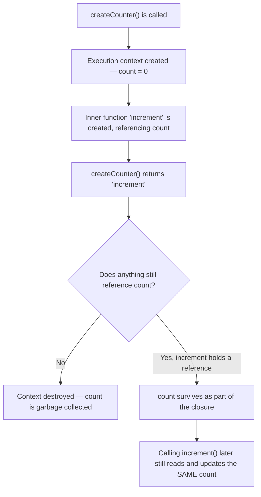

# Closures

> 🧠 **Quick Recall (30-sec refresher)**
> - A closure is a function that keeps access to its outer (lexical) scope's variables even after that outer function has returned — those variables are kept alive instead of being garbage collected, because the closure still references them.
> - A closure holds a **live reference** to a variable, not a snapshot of its value at creation time — if the variable changes before the closure is actually called, the closure sees the new value.
> - The classic proof: `var i` in a loop is one shared variable across every closure created inside it (they all end up seeing its final value); `let i` creates a fresh, independent binding per iteration, so each closure keeps its own.

**Tags:** #fundamentals #closures #lexical-scope #memory · **Interview Frequency:** 🔴 High · **Last Reviewed:** 2026-08-01

---

## Why This Matters
Closures are what make callbacks, event handlers, and factory functions like `createCounter` below actually useful — without them, a returned function couldn't remember anything from where it was created. They're also one of the single most-asked JS interview topics, almost always via the `var`-in-a-loop question.

## The Concept

A **closure** is what you get when a function is defined inside another function and keeps a reference to that outer function's variables — even after the outer function has already returned. Recall from [01](./01-how-js-works.md): normally, a function's execution context (and its local variables) is destroyed the moment it returns. Closures are the exception — if the returned (or otherwise retained) inner function still references an outer variable, JS keeps that specific variable alive instead of destroying it, because something can still reach it.

This only works because of **lexical scope** (from [04](./04-functions-and-scope.md)) — the inner function's access to outer variables was fixed at the moment it was *written*, nested inside the outer function. And critically, what a closure holds onto is a **reference** to the variable (per [03](./03-values-vs-references.md)), not a copy of its value at that moment — so if the variable changes later, the closure sees the change.

## Example Walkthrough

### Part 1 — The Basic Mechanic

```js
function createCounter() {
  let count = 0;

  return function increment() {
    count++;
    return count;
  };
}

const counter1 = createCounter();
console.log(counter1()); // 1
console.log(counter1()); // 2
console.log(counter1()); // 3

const counter2 = createCounter();
console.log(counter2()); // 1 — completely independent of counter1
```

`createCounter()` runs, creates `count`, defines `increment`, and returns it — normally, `count` would be destroyed right here. But `increment` still references it, so it survives. Each call to `createCounter()` creates a **brand-new** `count` and a brand-new closure over it — `counter1` and `counter2` never share state.

### Part 2 — Reference, Not Snapshot

```js
function makeGreeter() {
  let name = "Alice";

  function greet() {
    console.log(`Hello, ${name}`);
  }

  name = "Bob"; // changed AFTER greet was defined, BEFORE it's called
  return greet;
}

const greet = makeGreeter();
greet(); // "Hello, Bob" — not "Hello, Alice"
```

`greet` doesn't capture `name`'s value at the moment it was defined — it captures a live reference to the variable `name` itself. By the time `greet()` actually runs, `name` has already been reassigned, and the closure reflects that.

### Part 3 — The Classic Loop Bug

```js
function createFunctionsVar() {
  var fns = [];
  for (var i = 0; i < 3; i++) {
    fns.push(function () {
      console.log(i);
    });
  }
  return fns;
}

const fns = createFunctionsVar();
fns[0](); // 3
fns[1](); // 3
fns[2](); // 3 — every closure sees the same final value
```

```js
function createFunctionsLet() {
  var fns = [];
  for (let i = 0; i < 3; i++) {
    fns.push(function () {
      console.log(i);
    });
  }
  return fns;
}

const fixedFns = createFunctionsLet();
fixedFns[0](); // 0
fixedFns[1](); // 1
fixedFns[2](); // 2 — each closure keeps its own value
```

With `var`: `i` is function-scoped ([04](./04-functions-and-scope.md)), so there's exactly **one** `i` for the whole loop — every closure created inside references that same variable. By the time any of the returned functions is actually called, the loop has finished and `i` is `3`.

With `let`: the spec gives `for`-loops a special rule — **each iteration gets its own fresh binding** of `i`, initialized from the previous iteration's value. So each closure captures a reference to *its own iteration's* `i`, which is never touched again after that iteration ends.

### Part 4 — A Practical Use: Data Privacy

```js
function createBankAccount(initialBalance) {
  let balance = initialBalance;

  return {
    deposit(amount) {
      balance += amount;
      return balance;
    },
    withdraw(amount) {
      if (amount > balance) throw new Error("Insufficient funds");
      balance -= amount;
      return balance;
    },
    getBalance() {
      return balance;
    }
  };
}

const account = createBankAccount(100);
account.deposit(50);               // 150
account.withdraw(30);              // 120
console.log(account.getBalance()); // 120
console.log(account.balance);      // undefined — no direct access at all
```

`balance` is never exposed as a property — the only way to read or change it is through the three closures returned alongside it. This is how JS achieved private state before `#privateFields` existed, and it's still common in factory-function patterns today.

## Diagram



## Key Takeaways

- Closures are built on lexical scope.
- Closures keep variables alive after the outer function returns.
- Closures capture references, not value snapshots.
- Every call to an outer function creates a new closure.
- `var` shares one loop variable.
- `let` creates a new binding for every iteration.
- Closures enable private state and callbacks.


## Common Interview Questions

**Q: What is a closure?**

A: A function bundled with references to the variables from its surrounding (lexical) scope, which it keeps access to even after the outer function has finished running and would normally have its execution context destroyed.

**Q: Why doesn't the outer function's variable get garbage collected once the outer function returns?**

A: Because the returned (or otherwise retained) inner function still holds a live reference to it. JS only garbage-collects memory nothing can reach anymore — as long as a closure can reach a variable, it stays alive.

**Q: Does a closure capture a variable's value at creation time, or a live reference to the variable itself?**

A: A live reference. If the variable changes after the closure is created but before it's called, the closure sees the updated value — it's never a value snapshot.

**Q: Why does logging `i` inside a loop with `var` print the same final value for every callback, but `let` fixes it?**

A: `var` is function-scoped, so there's only one shared `i` for the entire loop — every closure created inside references that same variable, which has already reached its final value by the time any callback runs. `let` creates a brand-new binding of `i` for each iteration, so each closure captures its own iteration's independent value.

**Q: What's a practical, non-interview use for closures?**

A: Data privacy/encapsulation — a returned object's methods can share access to a variable that's otherwise completely unreachable from outside, which is how JS achieved "private" state before ES2022's `#privateFields`.

## Gotchas / Common Misconceptions

- **"Only special functions form closures."** Technically every function closes over its lexical scope — it's just that we only bother calling it "a closure" when that captured scope is actually used meaningfully after the outer scope would otherwise be gone.
- **"Closures automatically cause memory leaks."** They keep specific variables alive for as long as something can still reach them — which is often exactly the point. It only becomes a genuine leak if you hold onto a closure (e.g. in a global array, or an event listener you never remove) long after you actually need it.
- **"Arrow functions form closures differently than regular functions."** They don't — closures work identically for both, since closures are just lexical scope in action. The only thing special about arrow functions ([04](./04-functions-and-scope.md)) is `this`/`arguments` binding, not general variable closures.

## Keywords
`closure`, `lexical environment`, `lexical scope`, `data privacy`, `module pattern`, `factory function`, `garbage collection`, `IIFE`, `per-iteration binding`, `var`, `let`

## Related Notes
- [01 — How JS Works](./01-How-js-works.md) *(closures are the exception to "the context is destroyed on return")*
- [03 — Values vs. References](./03-values-vs-references.md) *(a closure captures a reference, not a value snapshot — this is why)*
- [04 — Functions & Scope](./04-functions-and-scope.md) *(closures are this exact lexical-scope model, applied to a function that outlives its creating scope)*
- [06 — Async JavaScript](./06-async-javascript.md) *(every callback that "remembers" something from where it was set up is a closure)*

## Revision Log
- 2026-08-01: First written.
